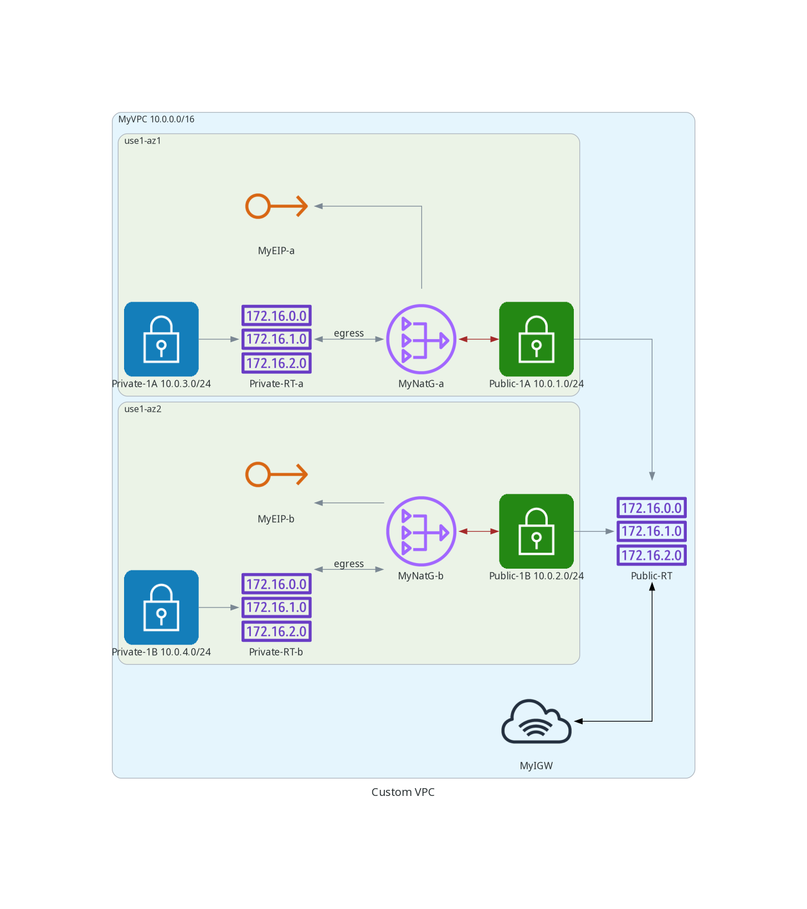
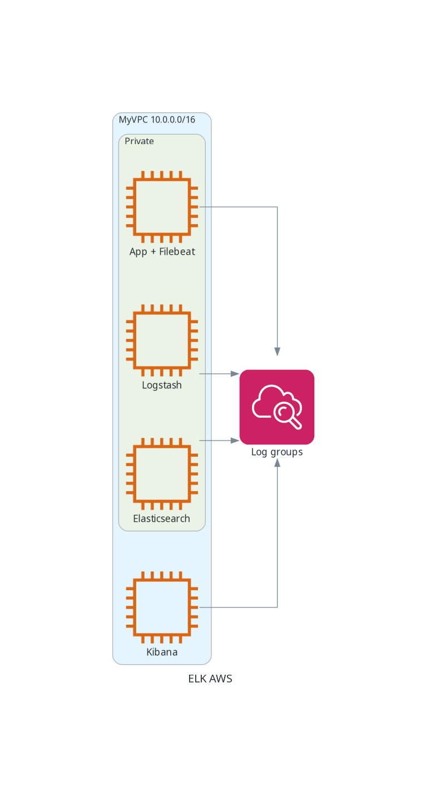

# elk

- using docker (on local)
- all components in a single ec2 instance
- create custom vpc and install elk components in seperate ec2 instances

Create custom vpc

Install various elk components in newly created vpc, and monitor logs using cloudwatch (using cloudwatch agent)
)